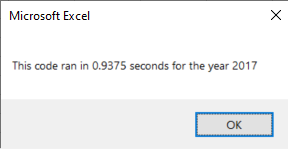
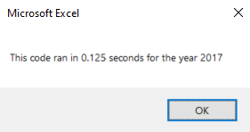
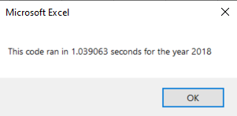
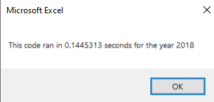
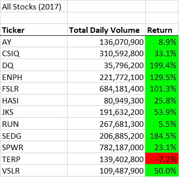
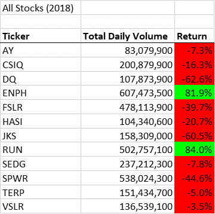

# Stock Analysis in VBA

## Overview of Project

### Purpose of Analysis
The purpose of this analysis was to help our good friend Steve quickly review stock performance so he could better advice his parents. We made a code in VBA to quickly screen through stocks for 2017 and 2018 by looking at annual volume and return.

## Results

### Stock Performance between 2017 and 2018
First we wanted to look at the total daily volume and return for each stock so we made a code with a 'For Loop' to run though each ticker index. We inserted a second 'For Loop' into the first one, to check each rows from 2 to RowCount, which was determined using the formula: RowCount = Cells(Rows.Count, "A").End(xlUp).Row. The nested For Loop computed the total daily volume for the year, set a starting price and an ending price used to generate the annual return.
```
For i = 0 To 11
   ticker = tickers(i)
   totalVolume = 0
    'loop through rows in the data
   Worksheets(yearValue).Activate
   For j = 2 To RowCount
       'Get total volume for current ticker
        If Cells(j, 1).Value = ticker Then

        totalVolume = totalVolume + Cells(j, 8).Value

        End If
       'get starting price for current ticker
        If Cells(j - 1, 1).Value <> ticker And Cells(j, 1).Value = ticker Then

        startingPrice = Cells(j, 6).Value

        End If
       'get ending price for current ticker
        If Cells(j + 1, 1).Value <> ticker And Cells(j, 1).Value = ticker Then

        endingPrice = Cells(j, 6).Value
        End If

   Next j
   
      'Output data for current ticker
    Worksheets("All Stocks Analysis").Activate
    Cells(4 + i, 1).Value = ticker
    Cells(4 + i, 2).Value = totalVolume
    Cells(4 + i, 3).Value = endingPrice / startingPrice - 1
    Cells(4 + i, 4).Value = startingPrice
    Cells(4 + i, 5).Value = endingPrice
    
   
Next i
```

For this original code it is very important to activate the correct worksheet in each loop since we analyze different years on different worksheet and output the results on another worksheet. We only had data for 2017 and 2018 but the code was made to be flexible in case other years are added. For this, we obtain the ‘yearValue’ variable using an input box and referencing to it throughout the code. When we want to insert the ‘yearValue’ text in a cell we used the`+ +` signs. 
```
Range("A1").Value = "All Stocks (" + yearValue + ")"
```
At the end of the code, we inserted a few lines of formatting applied to the rows and columns of interest then stopped our timer.

That first code was a little slow to run (~ 1 second) so we refactored our code using a new `tickerIndex` variable. This allowed us to store data for each ticker in the memory without having to run through each row multiple times while avoiding the nested loops. This new variable assigned an index across four aarays: 
```
tickerIndex(i), tickerVolumes(i), tickerStartingPrices(i), and tickerEndingPrices(i).
```
In this case, variables must be initialized as below:
```
tickerIndex = 0
Dim tickerVolumes(12) As Long
Dim tickerStartingPrices(12) As Single
Dim tickerEndingPrices(12) As Single
```
This new refactored code was almost ten times faster (~0.1 second) than the original code and will be very helpful for Steve as his dataset to analyze might just get bigger and bigger. 

#### Original Code 2017

#### Refactored Code 2017

#### Original Code 2018

#### Refactored Code 2018



Overall, 2017 was a great year to invest with all analyzed stocks in the green except for TERP with -7.2% return. On the other hand, 2018 could be considered a terrible year with 10 of the 12 stocks in the red with only ENPH and RUN having positive returns. While the dataset is small to make a clear conclusion, we would recommend Steve to invest in ENPH and RUN since these two stocks got positive returns even during a bad market year. This would suggest such companies are well managed, are keeping acceptable level of cashflow and are profitable even during uncertainties and economic downturn. 

#### Return 2017

#### Return 2018


## Summary

### Advantages and Disadvantages of Refactoring Code
Refactoring the code can increase the efficiency but can take extra time and therefore be more costly. T

### Advantages and Disadvantages of the Original and Refactored VBA Script

In the original code we run through each row, generate data then output it right away before moving to the next ticker. In the refactored code, we run through each row one time while storing the data in the memory for each ticker and output it all at same time in the end. While the refactored code is much faster, I believe we may run out memory if we run it on thousands of tickers instead of only twelve. The original code would be slower but empty the memory after each ticker. We would need to test how many tickers the refactored code can handle without crashing but for this purpose it works very well.
